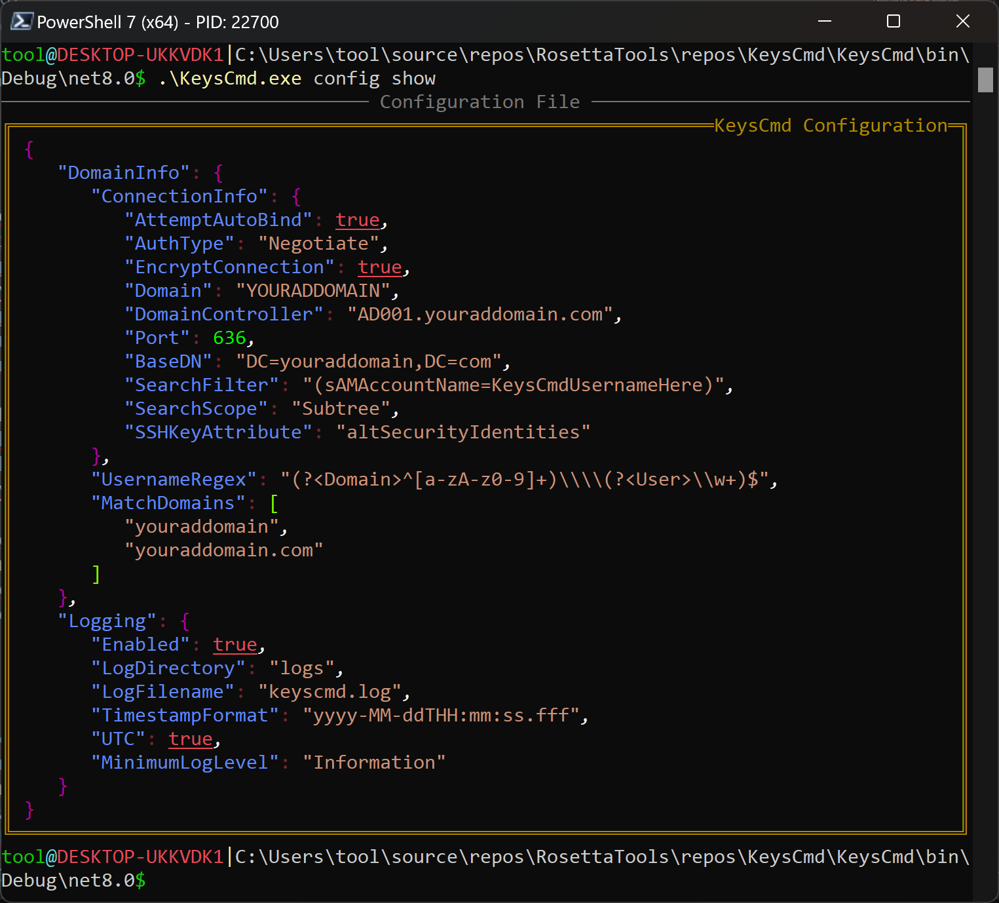

# KeysCmd

A console utility for retrieving SSH public keys stored in Active Directory for specified users. Primarily designed to run non-interactively to work with OpenSSH's `AuthorizedKeysCommand` configuration option in `sshd_config`, but it can also be used interactively to retrieve keys for a specific user, and show or edit its own configuration.

## Features

- **Active Directory Integration**: Retrieves SSH public keys from Active Directory user objects using the `altSecurityIdentities` attribute by default
- **OpenSSH Compatible**: Designed specifically for use with OpenSSH's `AuthorizedKeysCommand` `sshd_config` configuration option
- **Cross-Platform**: Runs on both Windows and Linux
- **Secure Authentication**: Multiple LDAP authentication methods with encryption enabled by default
- **Flexible Configuration**: JSON-based configuration with multiple location support, plus environment variables for sensitive information
- **Comprehensive Logging**: Maintains detailed logs for troubleshooting and auditing
- **Multi-Framework Support**: Compatible with .NET 8.0 as well as .NET Framework 4.8 for drop-in-and-run capability with Windows Server 2016 and later. Also targets .NET Standard 2.0 (compiles, but untested)

##


The image above demonstrates a successful SSH connection being made to a Windows Server 2019 host with `KeysCmd` being used as the `AuthorizedKeysCommand` executable in OpenSSH's `sshd_config` file. The `KeysCmd` utility retrieves the AD user's SSH public keys from Active Directory and returns them to OpenSSH for authentication.
##

## Installation

1. Download the latest release for your platform
2. Place the executable in your desired location
3. Configure the application (see Configuration section)
4. For OpenSSH integration, update your `sshd_config` as shown in the "OpenSSH Integration" section of this README

## Interactive Usage

### Examples

```pwsh

# Retrieve keys in OpenSSH-compatible mode
# Quoting the username is not mandatory
keyscmd keys get --user "DOMAIN\username" --openssh

# Parameters can be shortened and in any order
keyscmd keys get -o -u "DOMAIN\username"

# Retrieve SSH keys for a user with log messages printed
# to the console as well as the logfile (no --openssh/-o flag)
keyscmd keys get -u "DOMAIN\username"

# Shows the current configuration
keyscmd config show

# Edit the current configuration
keyscmd config edit

# Create a new configuration based on default settings
keyscmd config new

# Display help for the application
keyscmd --help

# Display help for a specific command
keyscmd keys --help

# Display help for a specific subcommand
keyscmd config new --help
```

### Command Aliases

The `keys` command also supports the following aliases:

- sshkeys
- userkeys

## Configuration

### Environment Variables

The following environment variables are supported:

- `KEYSCMD_USER`: Fully-qualified LDAP bind DN
- `KEYSCMD_PASSWORD`: LDAP bind password
- `KEYSCMD_DOMAIN`: AD domain (optional if specified in config, but this environment variable takes precedence if both are present)

**Important Note:** The environment variables listed above are optional on Windows, but they are *required* on Linux. This is due to the way the `System.DirectoryServices` collection of libraries handles authentication. If you're going to run `KeysCmd` on Linux or in Docker, you *must* set these environment variables.

### Config file

The application searches for its JSON configuration file `keyscmd.config.json` in the following locations (in absolute order of preference):

1. The same directory as the executable
2. System-wide location:
   - Windows: `C:\ProgramData\keyscmd`
   - Linux: `/etc/keyscmd` 
3. The directory listed in the `XDG_CONFIG_HOME` environment variable + `keyscmd` (Windows or Linux)
4. User-specific location in context of the executing user:
   - Windows: `%APPDATA%\keyscmd`
   - Linux: `~/.config/keyscmd`
5. If a config file does not exist in any directory listed above, a new config file with default settings will be created in one of the following locations:
   - The system-wide location listed in #2, which will be created if it does not exist (if running as an OS-default privileged user like `root`, `NT Authority\SYSTEM`, etc)
   - The directory listed in the `XDG_CONFIG_HOME` environment variable, if it exists, + `keyscmd`
   - The user-specific directory listed in #4, which will be created if it does not exist

### Example configuration JSON file:

```JSON
{
  "DomainInfo": {
    "ConnectionInfo": {
      "AttemptAutoBind": true,
      "AuthType": "Negotiate",
      "EncryptConnection": true,
      "Domain": "YOURADDOMAIN",
      "DomainController": "AD001.youraddomain.com",
      "Port": 636,
      "BaseDN": "DC=youraddomain,DC=com",
      "SearchFilter": "(sAMAccountName=KeysCmdUsernameHere)",
      "SearchScope": "Subtree",
      "SSHKeyAttribute": "altSecurityIdentities"
    },
    "UsernameRegex": "(?<Domain>^[a-zA-z0-9]+)\\\\(?<User>\\w+)$",
    "MatchDomains": [
      "youraddomain",
      "youraddomain.com"
    ]
  },
  "Logging": {
    "Enabled": true,
    "LogDirectory": "logs",
    "LogFilename": "keyscmd.log",
    "TimestampFormat": "yyyy-MM-ddTHH:mm:ss.fff",
    "UTC": true,
    "MinimumLogLevel": "Information"
  }
}
```

Or as shown by the `KeysCmd config show` command:



## OpenSSH Integration

To use `KeysCmd` with OpenSSH, add the following configuration to your `sshd_config` file (located at `C:\ProgramData\ssh\sshd_config` on Windows):

```sshd_config
AuthorizedKeysCommand /path/to/KeysCmd keys get -u "%u" --openssh
```

TODO: Add NTFS file permission details here, because OpenSSH freaks out if they're not JUST RIGHT

## Security Considerations

1. ***Always*** use encryption for LDAP connections (enabled by default). If you can't successfully connect over port 636 with encryption enabled, you have bigger problems. You **can** do plain text over port 389, and there's nothing stopping you from doing it, but just know that it's a monumentally stupid idea.
2. Use the environment variables mentioned above if you must use explicit credentials instead of Autobinding or using the `Negotiate` authentication method
3. Ensure proper file permissions for the configuration file. Although credentials are not stored in the configuration file, it can contain potentially sensitive information, depending on your environment.
4. Use a service account with read-only access to the directory *if possible*, but the current OpenSSH versions on Windows launch the `AuthorizedKeysCommand` as `NT Authority\SYSTEM` by default, so it may be unavoidable depending on your environment and setup.

## Building from Source

Requirements:

- .NET SDK 8.0 or later is recommended, but it will build and function on .NET Framework 4.8. Although `netstandard2.0` is a target framework, and it does compile, it hasn't been tested.
- Visual Studio 2022, compatible IDE, or the `dotnet` commandline tool

.NET Framework 4.8 is explicitly included as a target framework for compatibility and the ability to "just copy it over and run it" on Windows Server 2016 and later without any other external dependencies.

For Visual Studio, open the solution file and build the project. For the commandline, navigate to the project directory and run:

```pwsh
dotnet restore
dotnet build
dotnet publish -c Release -f net8.0
```

Replace `net8.0` with `net48` if building for .NET Framework 4.8. You can also publish to a self-contained single-file executable using any target framework; the resulting executable will launch and run on any system of the same OS platform and processor architecture with no external dependencies.

## License

This project is licensed under the MIT License - see the [LICENSE](LICENSE) file for details.

## Dependencies

Restoring NuGet packages will install the following dependencies:

- PolySharp
- Microsoft.Extensions.Configuration
- Microsoft.Extensions.Hosting
- Microsoft.Extensions.Logging
- Microsoft.Extensions.Logging.Abstractions
- Newtonsoft.Json
- Spectre.Console
- Spectre.Console.Cli
- Spectre.Console.Json
- System.DirectoryServices
- System.DirectoryServices.Protocols
